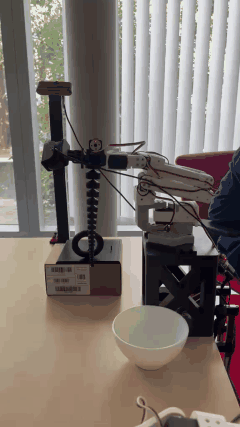

# Soft Tentacle End-Effector for the SO-ARM101

A cable-driven soft tentacle gripper that replaces the rigid gripper of the
[SO-ARM101 / SO-101](https://github.com/TheRobotStudio/SO-ARM100) robot arm,
built to explore soft manipulation and imitation/reinforcement learning for
palletization tasks.

> **Status:** working prototype, written up at the end of the internship so the
> work is not lost. The arm is built, driveable by teleoperation, and has picked
> the test object up and moved it. It is not a finished product. See
> [`docs/next_steps.md`](docs/next_steps.md) for what comes after.

---

## Overview

The stock SO-ARM101 ends in a rigid, 3D-printed parallel-jaw gripper driven by
one servo (motor 6). This project replaces that gripper with a **soft,
tendon-driven tentacle**.

The idea of turning this arm into a soft-robotics platform is **Simo Alami**'s,
who supervised the internship. The tentacle design is inspired by
[SpiRobs](https://github.com/ZhanchiWang/Open-Spiral-Robots) and by the
[Shoggoth Mini](https://github.com/mlecauchois/shoggoth-mini) project.

The design reuses **motor 6 as a winch**: it pulls a single cable that bends the
tentacle, while the existing wrist-roll joint (motor 5) rotates the plane of
curvature. No motors are added, and the HTDCR paper backs this up as a sound
architecture rather than a shortcut (see references).

<p align="center">
  
  <br>
  <em>The setup: the arm on its raised base, the tentacle, the ring on its stand
  and the bowl it goes into.</em>
</p>

### Where the learning fits

A tentacle has no clean model to control against, so learning the task is a
reasonable route.

- **Imitation learning (started).** Demonstrations are recorded by
  teleoperation, with both cameras, into a `LeRobotDataset`. One episode is in
  [`dataset/`](dataset/), and replaying it on the real arm reproduces the pick
  and place.
- **Reinforcement learning (the target).** Once the dataset is large enough,
  the plan is to move on to RL. The open decision is the action space, since
  the winch is not a position-controlled gripper. See
  [`docs/next_steps.md`](docs/next_steps.md).

The recording format was chosen with this in mind: the winch's action is stored
as the raw trigger value, so a trained policy can output the same thing a human
did. See [`docs/design_decisions.md`](docs/design_decisions.md).

### What was built

- A **custom interface support** that bolts where the stock gripper was, cradles
  motor 6, and routes the cable straight down into the tentacle base.
- A **tuner-peg winch** on motor 6, a guitar-tuner-style peg with the cable
  knotted through its shaft, which is what lets the tentacle relax as well as bend.
- A **raised base**, so the tentacle hangs clear of the table and can reach
  down to objects below the arm.
- A **camera mount on interlocking GoPro-style arcs**, giving two set-and-clamp
  rotations, so the webcam rides with the arm and can be re-aimed by hand
  instead of reprinted. The same arcs also fit the rigid claw.
- A **diagnostic/teleoperation CLI** ([`software/robot_tools.py`](software/robot_tools.py))
  including a software multi-turn winch controller, which the STS3215 servo does
  not provide natively.
- **Recording and replay** ([`record_winch.py`](software/record_winch.py),
  [`replay_winch.py`](software/replay_winch.py)) that drive the winch properly
  instead of treating it as a position-controlled gripper.

Replaying a recorded episode, the tentacle picked a toroid ring off its stand
and dropped it in a bowl. Teleoperate, record, replay, working end to end.

## Repository structure

```
.
├── README.md                 <- you are here
├── docs/
│   ├── design_decisions.md   <- why 1 cable, why this architecture, trade-offs
│   ├── lessons_learned.md    <- cable expansion, encoder limits, Windows gotchas
│   ├── next_steps.md         <- more episodes, RL, 3 cables, winch control
│   └── references.md         <- papers, models, and links used
├── hardware/
│   ├── ASSEMBLY.md           <- how to build and assemble everything
│   ├── interface_support/    <- the custom bracket (main contribution)
│   ├── tuner/                <- winch peg that mounts on motor 6
│   ├── tentacle/             <- generated SpiRob body
│   ├── arc_plate/            <- GoPro-style arcs on a bolt-on plate (V5 uses this)
│   ├── camera_mount/         <- webcam support that couples to the arcs
│   ├── rotation_claw/        <- rigid gripper adapted to carry the arc plate
│   ├── base/                 <- raised block and the plate the arm bolts to
│   └── test_objects/         <- grasping targets
├── dataset/                  <- one recorded episode, with both camera videos
├── media/                    <- photos and clips of the build
└── software/
    ├── README.md             <- how to set up the environment from scratch
    ├── robot_tools.py        <- diagnostic/teleop CLI (move, spool, trigger, ...)
    ├── record_winch.py       <- records a dataset with winch control
    ├── replay_winch.py       <- plays a recorded episode back on the arm
    ├── config.py             <- ports, IDs and camera indices
    ├── requirements.txt
    └── s0101code_simo/       <- Simo Alami's pipeline, for the rigid claw
```

## Hardware summary

| Part | Material | Source |
|------|----------|--------|
| Interface support (bracket) | PLA / PETG | Custom, modeled in Fusion |
| Winch (tuner peg + attachment) | PLA | Custom, guitar-tuner style |
| Tentacle body | TPU 95A | Generated with the OpenSpiRobs tool |
| Camera mount | PLA | Custom arc interface on Simo Alami's wrist mount |
| Raised base | PLA | Custom extension of the stock SO-101 base |
| Cable | 0.5 mm nylon fishing line | Off-the-shelf ([link](https://www.amazon.fr/dp/B0B8N7151L)) |

See [`hardware/ASSEMBLY.md`](hardware/ASSEMBLY.md) for the bill of materials
and step-by-step assembly.

## Software summary

Built on the [LeRobot](https://github.com/huggingface/lerobot) ecosystem
(v0.6.0), on Windows. The arm is a **follower** SO-101, teleoperated from a
paired **leader** arm. See [`software/README.md`](software/README.md) for setup.

Recording and replay needed their own scripts because the winch cannot be
driven as a position-controlled gripper. `software/s0101code_simo/` is Simo
Alami's pipeline, which works for the rigid claw and was the starting point for
mine.

## Credits

- **Simo Alami**, who supervised the internship, proposed converting the arm to
  a soft end-effector, and whose camera mount and LeRobot pipeline this builds
  on.
- **SpiRobs** and **Shoggoth Mini**, for the tentacle design and for showing it
  running on the same STS3215 servos.

## References

Key prior work. See [`docs/references.md`](docs/references.md) for the full
list with DOIs:

- **SpiRobs**: logarithmic-spiral soft robots (Wang, Freris & Wei, *Device*, 2025)
- **Shoggoth Mini**: SpiRob-based tentacle using the same STS3215 servos + LeRobot
- **HTDCR**: hybrid single-tendon continuum robot that avoids torsion (Huertas Niño, Boutayeb & Martinez, *Frontiers in Robotics and AI*, 2025)
- **DEFROST / SOFA**: FEM modeling and control of soft robots (Coevoet, Escande & Duriez, Inria)

## License

No license chosen. This is an internal handoff document, not a public release.
If it is ever published, note that the tentacle generator (OpenSpiRobs) is under
the PolyForm Noncommercial License 1.0.0, and see
[`hardware/ASSEMBLY.md`](hardware/ASSEMBLY.md) for which models are original and
which are only linked.
