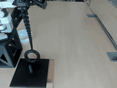
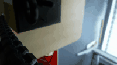

# Dataset

`tentacle_pickplace2/` is one recorded episode, kept here as proof the pipeline
works end to end. It is a `LeRobotDataset` (codebase version 3.0), recorded with
[`../software/record_winch.py`](../software/record_winch.py).

| | |
|---|---|
| Task | *Pick up the toroid with the tentacle and drop it elsewhere* |
| Episodes | 1 |
| Frames | 797 at 30 fps, so about 26 seconds |
| Robot | `so_follower` |
| Size | 7.3 MB, nearly all of it video |

## What is in a frame

| Feature | Type | Shape |
|---|---|---|
| `action` | float32 | 6, the five joints plus the winch trigger |
| `observation.state` | float32 | 6, the same, read back from the arm |
| `observation.images.wrist` | video | 360 × 640, camera on the arm |
| `observation.images.top` | video | 480 × 640, overhead camera |

The sixth number in `action` is **not** a gripper position. It is the leader
trigger's raw 0–100% value, because the winch runs in velocity mode and has no
single position to record. See
[`../docs/design_decisions.md`](../docs/design_decisions.md).

## The two videos

<div align="center">
<table>
<tr>
  <th align="center">Top camera</th>
  <th align="center">Wrist camera</th>
</tr>
<tr>
  <td align="center"></td>
  <td align="center"></td>
</tr>
<tr>
  <td align="center"><em>The workspace, with the ring on its stand and the bowl</em></td>
  <td align="center"><em>Rides with the arm, looking down the tentacle</em></td>
</tr>
</table>
</div>

Both show the same episode, sped through at 5 fps. The full-quality mp4s are in
[`tentacle_pickplace2/videos/`](tentacle_pickplace2/videos/), one per camera.

## How it was recorded

Teleoperation from the leader arm, with the winch on bang-bang trigger control
rather than the position-controlled gripper `lerobot-record` expects. One take,
about 26 seconds: pick the ring off its stand, move it across, drop it in the
bowl.

Replaying this episode with
[`../software/replay_winch.py`](../software/replay_winch.py) reproduces the
pick and place on the real arm.

## Using it

The dataset here is a copy. To record more episodes into it, work from the
LeRobot cache copy (`~/.cache/huggingface/lerobot/enzo/tentacle_pickplace2`)
and use `--resume`:

```powershell
python record_winch.py --repo-id enzo/tentacle_pickplace2 --num-episodes 20 `
    --single-task "Pick up the toroid with the tentacle and drop it elsewhere" --resume
```
