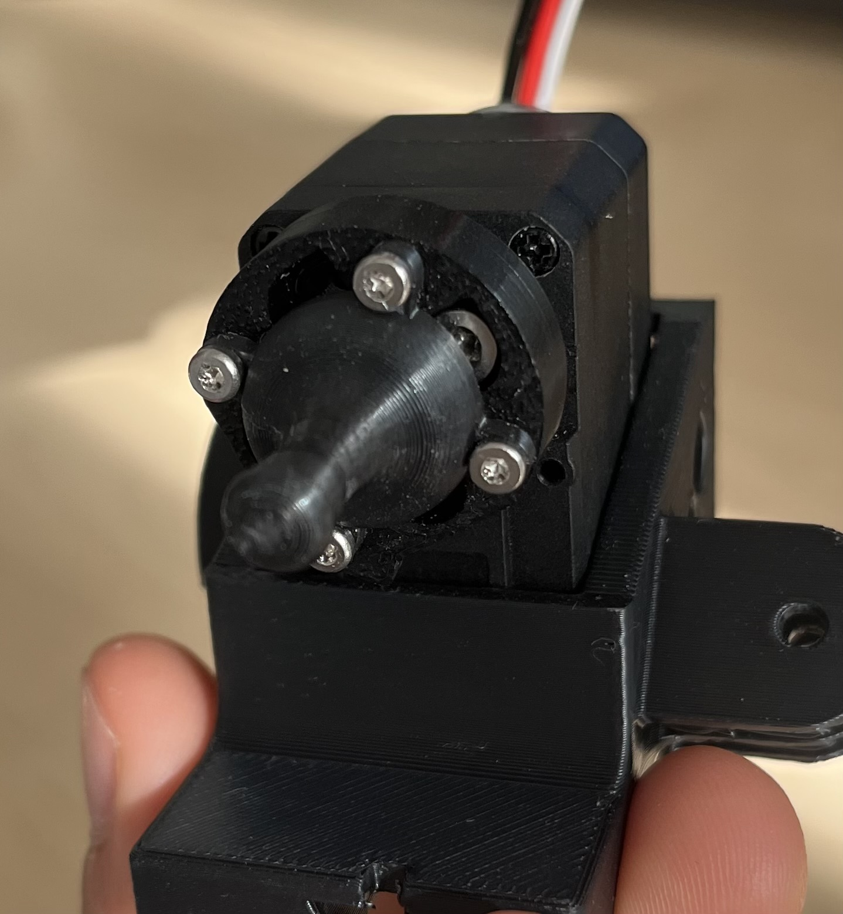
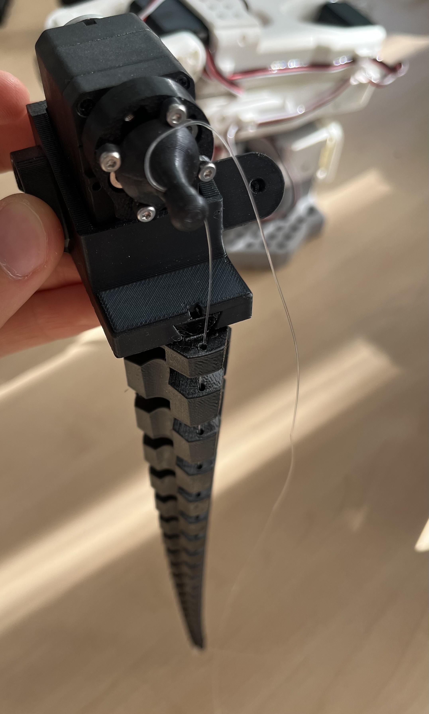
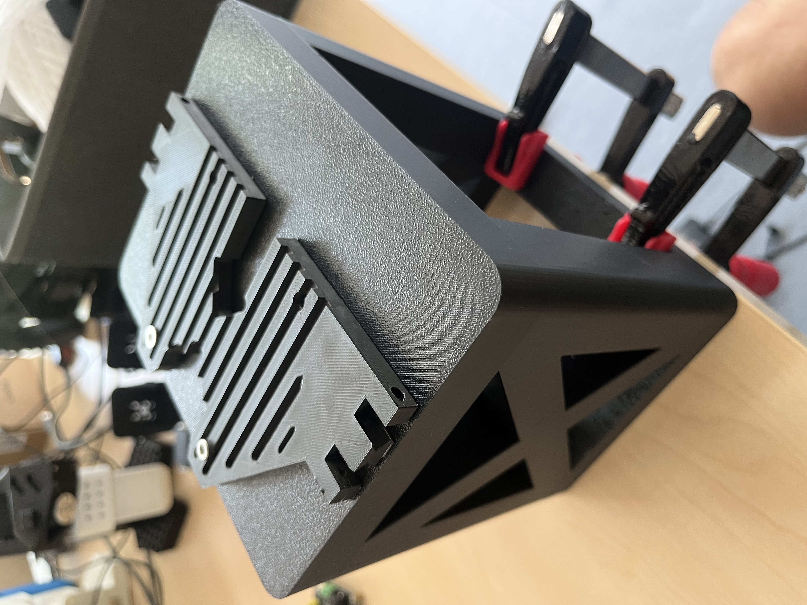
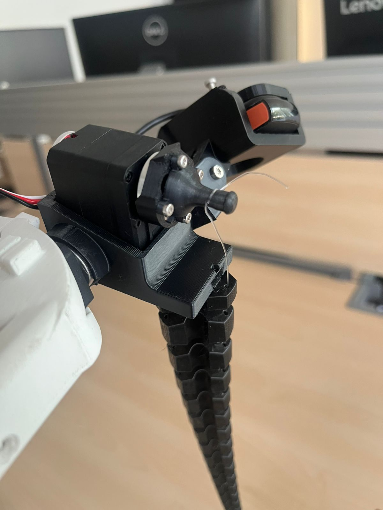
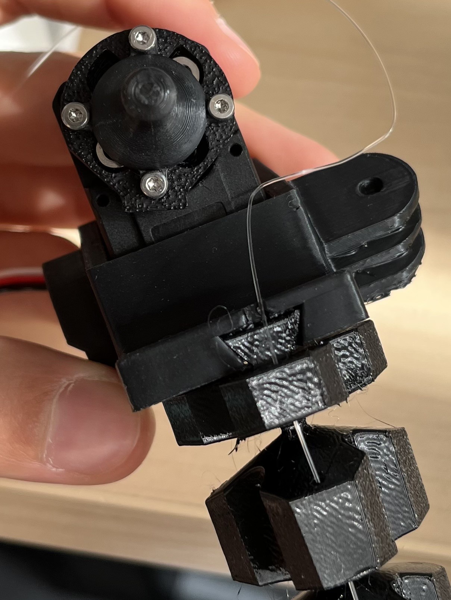
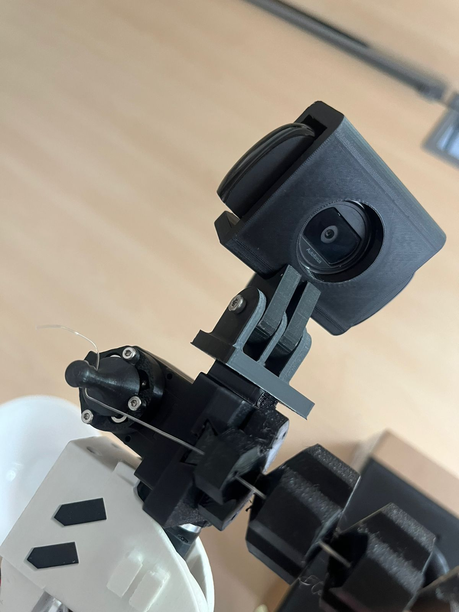

# Assembly

How to build the tentacle end-effector onto an SO-101 arm.

---

## Parts

### Printed

| Part | File | Material |
|---|---|---|
| Interface support | `SupportV5.stl` | PLA or PETG |
| Arc plate | `Rotation_Plate.stl` | PLA or PETG |
| Tuner | `Tuner.stl` | PLA |
| Tuner attachment | `TunerAttachmentV2.stl` | PLA |
| Tentacle | `spirobs.stl` | TPU 95A |
| Raised base | `Raised_Base.stl` + `arm_base.stl` | PLA |
| Camera mount | `Webcam_Mount_Wrist_custom_v4.stl` | PLA |

Printed with the printer's default profile, no tuning needed. The tentacle is
the only slow one.

### Everything else

| Item | Qty |
|---|---|
| M3 screws, support to joint 5 | 4 |
| Small screws, motor 6 into the support | 2 |
| M3 screw + heat-set insert, arc plate onto the support | 1 each |
| M3 screw + heat-set insert, camera onto its mount | 1 each |
| M4 screws + heat-set inserts, arm onto the raised base | 4 each |
| 0.5 mm nylon fishing line ([this one](https://www.amazon.fr/dp/B0B8N7151L)) | ~1 m |
| Webcam | 1 |

Nylon works best. Guitar string and twine were both tried and both do the job
up to a point, but nylon is the one to use. See
[`../docs/lessons_learned.md`](../docs/lessons_learned.md#the-cable-comes-off-the-winch-unless-you-knot-it).

---

## Steps

### 1. Print

Start with the tentacle. It is the longest print, and its base diameter decides
whether the support socket fits.

### 2. Strip the wrist

Remove `Moving_Jaw_SO101` and `Wrist_Roll_Follower_SO101`. Leave motor 6 on the
bus; it becomes the winch. Nothing below joint 5 changes.

### 3. Fit the tuner

`TunerAttachmentV2` mounts on motor 6. `Tuner` bolts onto it through the four
ears around its dome. The tuner's shaft has a hole across it for the nylon, and
when motor 6 turns the nylon winds around the shaft and pulls the tentacle.

<p align="center">
  
  <br>
  <em>The tuner bolts on through the four ears. The hole for the nylon is in the shaft sticking out of the middle.</em>
</p>

### 4. Bolt the support to joint 5

4× M3 into the pattern the old gripper used. Drop motor 6 into its cradle and
hold it with the 2 small screws.

**Check the alignment before going further:** the cable hole in the tentacle
socket has to sit directly under the tuner. If the cable comes off at an angle
it rubs the edge of the hole, which eats winch torque and wears the line
through.

<p align="center">
  
  <br>
  <em>The line should drop straight from the tuner into the hole, like this, not off to one side.</em>
</p>

### 5. Fit the arc plate

Bolt `Rotation_Plate` onto the support with one M3 into a heat-set insert. This
is the mount the camera clips onto in step 9.

Both arc joints are set by hand and clamped, so you can aim the camera later
without reprinting anything. Leave them loose for now and set the angles once
the camera is on.

### 6. Mount the raised base

Two parts. `Raised_Base` is the block that lifts everything, and `arm_base` is
the ribbed plate that bolts on top. The arm screws onto it with four M4 into
heat-set inserts.

The base lifts the arm so the tentacle hangs clear of the table instead of
dragging on it. **Clamp the base to the table.** With the arm raised it is not
stable on its own.

<p align="center">
  
  <br>
  <em>The raised block with the ribbed plate bolted on top. The clamps holding it to the table are behind it.</em>
</p>

### 7. Thread the cable

Tip of the tentacle → down the internal channel → out the base → through the
hole in the support → through the hole in the tuner shaft → **tie a knot**.

> **Do not skip the knot.** Without it the line is only held by the friction of
> its own wrap, and it will not pay back out when the motor reverses. The
> tentacle bends in and never straightens.

Wind it on in the direction that bends the tentacle when motor 6 winds in.
Check by hand first. Leave a little tension on it at rest.

<p align="center">
  
  <br>
  <em>The line wrapped on the shaft and knotted on the far side.</em>
</p>

### 8. Seat the tentacle

The tentacle base has a trapezoidal shape that slots into the support. No glue,
no screw. Push it in until it seats.

<p align="center">
  
  <br>
  <em>The tentacle base slotted into the support, with the arc plate on the right.</em>
</p>

### 9. Mount the camera

Clip the camera mount onto the arc plate from step 5, aim it by hand, and clamp
both arc joints. Keep the tentacle tip and the work area in frame.

<p align="center">
  
  <br>
  <em>The camera on the arcs, above the tuner and the tentacle.</em>
</p>

### 10. Recalibrate and test

The wrist mass changed, so recalibrate. Type `c` for a fresh calibration.

```powershell
lerobot-calibrate --robot.type=so101_follower --robot.port=COM3 --robot.id=my_arm
```

Then test the winch a little at a time:

```powershell
python robot_tools.py spool
```

```
dir cw
speed 300
roll 0.5
```

Watch the load numbers and increase the turns slowly. Keep a hand near the
power switch. A dropped stop command can leave the winch spinning, and the
tentacle will wind itself up until something breaks.

---

## Files

| Folder | What is in it |
|---|---|
| `interface_support/` | The bracket. V5 is the one to print; V3 and V4 are kept too |
| `arc_plate/` | The three GoPro arcs on a plate. V5 bolts to this, and the camera mount clips onto it |
| `tuner/` | The winch: the tuner peg and the attachment that holds it on motor 6. Print `TunerAttachmentV2`, which rounds off the corner you push on when setting motor 6 by hand. V1 is kept too |
| `tentacle/` | The generated SpiRob body, STL only |
| `camera_mount/` | Webcam support, adapted from Simo Alami's design |
| `rotation_claw/` | The rigid gripper claw, adapted so the arc plate glues onto it |
| `base/` | The raised block and the ribbed plate the arm bolts to |
| `test_objects/` | `Ring`, the target for the tentacle to grab, and `StickV2`, the stand it sits on |

Not committed here, get them from the source instead: stock SO-101 parts and
`Raised_Base_Extension` from [SO-ARM100](https://github.com/TheRobotStudio/SO-ARM100),
and the Shoggoth Mini reference parts from
[Shoggoth Mini](https://github.com/mlecauchois/shoggoth-mini).

Fusion `.f3d` files are gitignored. Export STEP/STL here instead.
